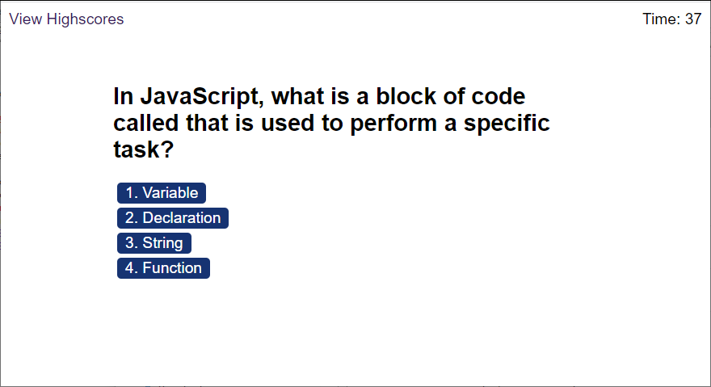

# Code Quiz

## Description

This site is a timed quiz on JavaScript fundamentals that stores high scores.  It is used to compare the progress of various students.

## Table of Contents 

* [Website](#Website)

* [Usage](#Usage)

* [License](#License)

* [Repository](#Repository)

* [Questions](#Questions)

## Website:

[https://jrdrenth.github.io/codequiz/](https://jrdrenth.github.io/codequiz/)

## Usage

Answer the quiz questions as accurately and quickly as possible for the best score!

## License:

This app is licensed under the MIT license.

## Repository:

[https://github.com/jrdrenth/codequiz](https://github.com/jrdrenth/codequiz)

## Questions:

If you have any questions, please contact me at john.drenth@gmail.com.  My github profile can be found at [https://github.com/jrdrenth/](https://github.com/jrdrenth/).
